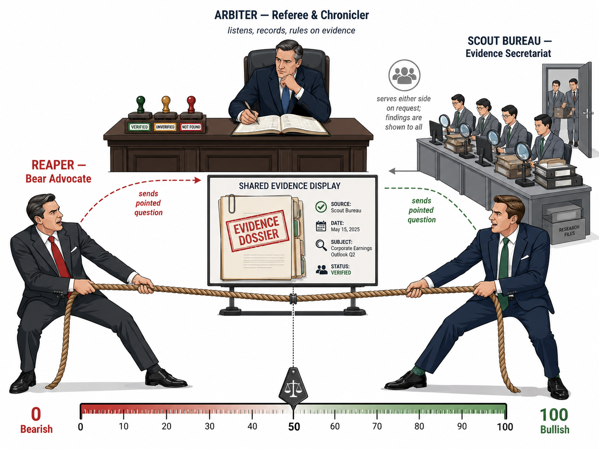
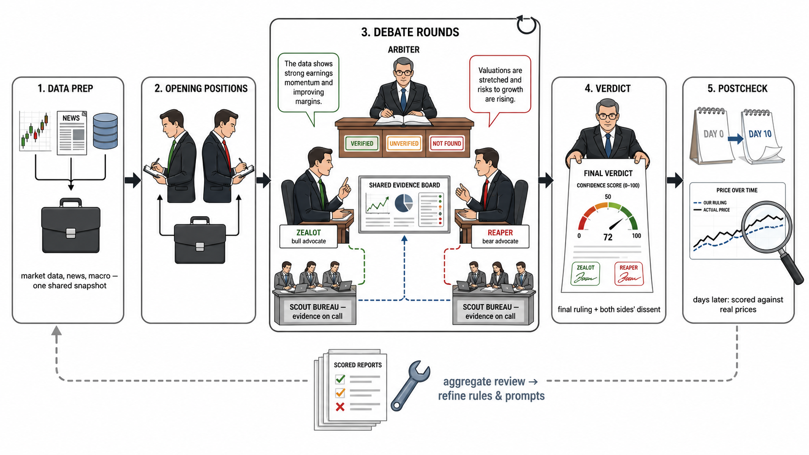
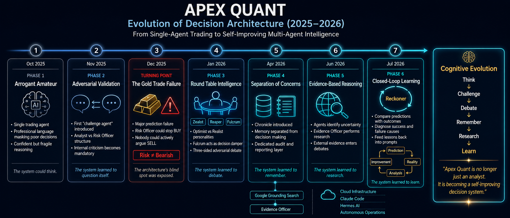

**English** | [**中文**](#中文版)

# ⚖️ Apex Quant

### Adversarial Multi-Agent Debate Framework for Quantitative Analysis

[](https://creativecommons.org/licenses/by-nc-sa/4.0/)
[](https://papers.ssrn.com/abstract=6354961)
[](https://www.python.org/)

---

Apex Quant is an LLM-based multi-agent framework for quantitative analysis. Before any decision is emitted, agents holding **opposing stances** must complete a structured debate. Most multi-agent trading frameworks split agents by **data type** (fundamentals, sentiment, technicals); Apex Quant splits them by **stance**. The framework is market-agnostic; the current implementation covers US / EU / JP / KR equities.

> **This is the v2 edition.** The debate was reshaped after a data-driven post-mortem: two advocates + an arbiter, backed by Postgres and run agent-natively. The original three-debater, file-based v1 is archived in [`README-v1.md`](README-v1.md) and frozen on the [`v1` branch](../../tree/v1).
>
> **→ Read the [Design Philosophy / 设计哲学](docs/design-philosophy.md)** (bilingual) for the whole story — including *why* v1 became v2.

> **A note on scope:** the v2 code isn't published here (yet). It's Postgres-backed and split across three parallel runners (API / Claude Code / GPT Codex), which makes it a real chore to untangle and scrub for release. So for now this repo open-sources the **thinking** — the design philosophy and this README — while the runnable reference code is the archived **v1**.

> **Language note:** prompts, debate transcripts, and analysis output are Chinese-only for now. A dedicated translation layer that renders each final report into other languages is planned as a clean downstream step.

---

## 🏛️ Architecture: two advocates, an arbiter, evidence on call



- 🔴 **Zealot** — the bull advocate. Builds the strongest long case and never exits easily.
- 🔵 **Reaper** — the bear advocate; not a doomer but a profit-taker, asking "is this position still worth holding?"
- ⚖️ **Arbiter** — presides over the debate. It rules only on **evidence** (stamps each item `verified` / `unverified` / `not-found`), controls the floor (repeat-detection, shelving, termination), and writes the final report. It absorbed the old **Chronicler**'s archivist role. It does **not** vote on direction.
- 🔭 **Scout** — a neutral evidence corps, spawned on demand, one per question. Two legs: a **lateral-data** leg (peer comparison via IBKR — relative strength / valuation against a stock's *real* peers, not just a broad index) and a **web-search** leg (tracing the cause-and-effect of a news item). Its findings are shown to both sides.

**What changed from v1.** The **Fulcrum** damper — a neutral third pole — was retired. An n=56 post-mortem measured it as net neutral-to-negative: it destroyed value as often as it saved, and even its "saves" tended to land below the pass line (a dead-HOLD, opportunity-missing pattern). Its one useful function, rebuttal, was internalized into the two advocates; the Bayesian concession rule was re-gated so only *verified* evidence can force a step back; and a **directed-evidence** inlet was added so debate rounds inject new information instead of merely compressing toward the mean. The full reasoning — and the data — is in the [design philosophy](docs/design-philosophy.md).

---

## 🔄 The debate flow



1. **Data prep** — market data, news, macro, plus pre-hydrated peer & economic evidence, assembled into one shared snapshot.
2. **Opening positions** — Zealot and Reaper each form an independent judgment, with no communication.
3. **Debate rounds** — multi-round argument under the constitution. Each round may fire **directed evidence** requests at the opponent's specific claim; the Arbiter dispatches Scouts and stamps every result `verified` / `unverified` / `not-found`, shared with both sides. **Concession is gated on *verified* evidence** — an unfalsifiable "there's risk" no longer extorts a step back.
4. **Verdict** — a 0–100 **confidence dial** (0 = extreme bearish, 50 = neutral, 100 = extreme bullish — *not* a buy/sell instruction) alongside actual execution (BUY / HOLD / SELL + sizing + entry/stop) and a decoupled **short-term** tactical view. Both advocates attach their dissent.
5. **Postcheck — the "BP" loop.** Days later, each call is scored against real prices (**0 = whiff / 50 = miss / 100 = hit**), reviewed by a single **reckoner** agent, abstracted into recurring failure modes, and fed back to refine prompts and architecture. BP = **backpropagation**: the system is trained by its own post-mortems. (Removing Fulcrum and rewriting the Bayesian rule were BP's first big updates.)

---

## 🗄️ Data, search & runners

All state now lives in **PostgreSQL** — technicals, news, reports, economic indicators, sentiment, and postcheck. The earlier on-disk JSON / CSV outputs are gone.

| Data | How it's obtained |
|---|---|
| Prices, multi-timeframe candlesticks, peer data | **Interactive Brokers (IBKR)** — the one deterministic leg |
| Stock news | **US:** Finnhub (the init leg). **EU / JP / KR:** Linkup (the API-version leg) *or* agent web-search on the Claude Code / GPT Codex runners |
| Macro & company fundamentals | increasingly **agent-searched** (Alpha Vantage / a PG cache remain as fallback) |
| Market sentiment (Fear & Greed / VIX) | **per region** — CNN Fear & Greed for the US, with regional equivalents for EU / JP / KR |

**Three runners, one architecture.** The same debate-and-postcheck logic runs in three variants: an **API version** (DeepSeek for the agents + Linkup or Gemini grounding for search), a **Claude Code version**, and a **GPT Codex version**. In practice AI still rewards raw power — my self-built DeepSeek + Linkup search turned out *far* worse than Claude / GPT with **native search**. So the CC and Codex versions are now the main runners (the API version is kept as a fallback), and it isn't only data-fetching that leans on agent search — the **core debate and postcheck themselves** run on the agents.

**Agent-native "deployment."** There's no `git clone && deploy` anymore: you **hand the repo to Claude Code or GPT Codex and let it set everything up**. Orchestration runs through agents — a **Hermes** heartbeat wakes Claude Code on schedule; a parallel **GPT Codex** dispatch path exists; and the debate / postcheck skills can copy themselves from the server onto a fresh machine. This edition leans on agents by design, which is also why it's less of a turnkey repo than v1 was.

> **Display note:** the dashboard still renders the **v1** view (three debaters) for now; the v2 display update comes later.

---

## 🧭 Design philosophy

The transferable part of this project isn't the code — it's what the work *taught* me about making an LLM that *talks* finance actually *do* finance. That's written up as an evolving, bilingual retrospective:

> **→ [Design Philosophy / 设计哲学](docs/design-philosophy.md)**

---

## 📄 Paper

> **Apex Quant: A Multi-Agent Debate Framework for Quantitative Trading**
> Shuting Sun · SSRN Technical Report · March 2026
> [→ https://papers.ssrn.com/abstract=6354961](https://papers.ssrn.com/abstract=6354961)

```bibtex
@techreport{sun2026apexquant,
  title  = {Apex Quant: A Multi-Agent Debate Framework for Quantitative Trading},
  author = {Sun, Shuting},
  year   = {2026},
  url    = {https://papers.ssrn.com/abstract=6354961}
}
```

---

## 🗂️ v1 archive

The original edition — three debaters (Zealot / Reaper / **Fulcrum**) + a separate Chronicler, with everything on disk as JSON / CSV — is preserved for reference:

- [`README-v1.md`](README-v1.md) — the full v1 README (data schema, DAG scheduler, examples, etc.)
- [`v1` branch](../../tree/v1) — the frozen v1 codebase

---

<details>
<summary>🕰️ <b>Timeline (click to expand)</b></summary>

From an overconfident single agent to today's two-advocate + arbiter architecture.



</details>

---

## ⚠️ Disclaimer

This project is for research and personal use only. It does not constitute investment advice.

## 📜 License

[CC BY-NC-SA 4.0](https://creativecommons.org/licenses/by-nc-sa/4.0/) — Non-commercial, attribution, share-alike.

Questions and discussion welcome: **sst19910323@gmail.com**

---

<a id="中文版"></a>

# ⚖️ Apex Quant — 中文

### 基于对抗性多智能体辩论的量化分析框架

---

Apex Quant 是一个基于大语言模型的多智能体量化分析框架。在给出任何决策之前，持**对立立场**的 agent 必须先完成一场结构化辩论。多数多智能体交易框架按**数据类型**分工（基本面、情绪、技术面），而 Apex Quant 按**立场**分工。框架本身与市场无关，当前实现覆盖美股 / 欧股 / 日股 / 韩股。

> **这是 v2 版。** 辩论结构经过一次数据驱动的复盘后被重塑：二元辩手 + 一位仲裁者，底层转 Postgres，以 agent 原生方式运行。最初那套三辩手、基于文件的 v1 已存档在 [`README-v1.md`](README-v1.md)，并冻结在 [`v1` 分支](../../tree/v1)。
>
> **→ 完整来龙去脉（包括*为什么*从 v1 走到 v2）见 [设计哲学 / Design Philosophy](docs/design-philosophy.md)**（中英双语）。

> **关于范围：** v2 的代码暂未在此公开。它已转 Postgres、又拆成三个平行运行版本（API / Claude Code / GPT Codex），整理、脱敏、打包成可发布的样子相当麻烦。所以这个仓库眼下开源的是**思路**——设计哲学和这份 README——而可运行的参考代码，是存档的 **v1**。

> **语言说明：** prompt、辩论记录与分析输出目前仅中文。计划在下游单设一层翻译，把每份终报干净地渲染成其他语言。

---

## 🏛️ 架构：两位辩手、一位仲裁者、按需取证


- 🔴 **Zealot** —— 多头辩手，构建最强的做多理由，不轻易离场。
- 🔵 **Reaper** —— 空头辩手；不是唱衰者，而是止盈者，只问"这仓还值不值得留"。
- ⚖️ **Arbiter（仲裁者）** —— 主持辩论。它只裁**证据**（给每条盖 `verified` / `unverified` / `not-found`），控场（复读检测、搁置争议、终止判定），并写终报。它接管了原来 **史官（Chronicler）** 的存档职能，但**不对方向投票**。
- 🔭 **Scout（取证员）** —— 中立取证队，按需派出、一问一员。两条腿：**横向数据腿**（经 IBKR 做同业对比 —— 相对强弱 / 估值，比的是这只票*真正的*同行，而非泛泛大盘）和**联网搜索腿**（理清一条新闻的前因后果）。取证结果对两边公开。

**相比 v1 变了什么。** 当阻尼器的中立第三极 **Fulcrum** 被退役了。一次 n=56 的复盘量出它净贡献中性偏负：毁值和拦截一样多，连"拦对"的也多半够不上及格线（一种"死 HOLD、白错过机会"的形态）。它唯一有用的"反驳"职能被拆进两位辩手内化；贝叶斯退让规则被重新设门槛，只有 *verified* 证据才能逼退让；再加一个**定向取证**的信息入口，让每轮辩论真的注入新信息、而非只朝均值压缩。完整推理与数据见[设计哲学](docs/design-philosophy.md)。

---

## 🔄 辩论流程


1. **备餐（Data Prep）** —— 行情、新闻、宏观，外加预先水合的同业与经济证据，汇成一份共享快照。
2. **开局立场** —— Zealot 与 Reaper 各自独立判断，互不通气。
3. **多轮辩论** —— 在宪法约束下多轮交锋。每轮可对对方的具体主张发起**定向取证**；仲裁者派 Scout、给每条结果盖 `verified` / `unverified` / `not-found` 并三方共享。**退让以 *verified* 证据为门槛** —— 一个不可证伪的"有风险"再也讹不到退让。
4. **裁决** —— 一个 0–100 的**信心刻度**（0 极空、50 中性、100 极多 —— *不是*买卖指令）+ 实际执行（BUY / HOLD / SELL + 仓位 + 入场/止损）+ 一个解耦的**短线**战术视图；两位辩手各自附上异议。
5. **后验 —— "BP" 闭环。** 若干天后，用真实价格给每次判断打分（**0 踩空 / 50 错过 / 100 踩中**），由单个 **reckoner（清算者）** 复盘、抽象成共性失误、反馈回去调 prompt 与架构。BP = **反向传播**：系统是被自己的复盘"训练"出来的。（拆 Fulcrum、改贝叶斯，就是 BP 跑出来的头两个大更新。）

---

## 🗄️ 数据、搜索与运行版本

所有状态现已存入 **PostgreSQL** —— 技术指标、新闻、报告、经济指标、情绪、后验。此前的 JSON / CSV 文件输出已取消。

| 数据 | 怎么取 |
|---|---|
| 行情、多时间尺度 K 线、同业数据 | **盈透（IBKR）** —— 唯一确定性的一条腿 |
| 个股新闻 | **美股：** Finnhub（init 腿）。**欧 / 日 / 韩：** Linkup（API 版那条腿）*或* Claude Code / GPT Codex runner 的 agent 联网搜索 |
| 宏观与公司基本面 | 越来越靠 **agent 搜索**（Alpha Vantage / PG 缓存留作兜底） |
| 市场情绪（Fear & Greed / VIX） | **分区** —— 美股用 CNN Fear & Greed，欧 / 日 / 韩各有对应的区域指标 |

**三个运行版本，同一套架构。** 同一套"辩论 + 后验"逻辑跑在三个版本里：**API 版**（agent 用 DeepSeek、搜索用 Linkup 或 Gemini grounding）、**Claude Code 版**、**GPT Codex 版**。实践下来 AI 到底还是讲究"力大砖飞"—— 我自己搭的 DeepSeek + Linkup 搜索，比 Claude / GPT 的**原生搜索**差很多。所以如今主力是 CC 版和 Codex 版（API 版留作兜底）；而且不只是取数靠 agent 搜索，**核心的辩论与后验本身也跑在 agent 上**。

**agent 原生的"部署"。** 不再是 `git clone && 部署`：而是**把仓库交给 Claude Code 或 GPT Codex，让它自己把一切装好**。编排交给 agent —— 一个 **Hermes** 心跳按点唤醒 Claude Code；另有一条并行的 **GPT Codex** 通路；辩论 / 后验的 skill 还能从服务器自拷到一台新机器。这一版从设计上就重度依赖 agent，这也是它不像 v1 那样开箱即用的原因。

> **展示说明：** 看板目前仍渲染 **v1** 视图（三辩手）；v2 界面之后再更新。

---

## 🧭 设计哲学

这个项目真正可迁移的不是代码，而是这一路让我明白的一件事：**怎么让一个会"说"金融的 LLM，真正"会做"金融。** 这些写成了一份持续演进、中英双语的回顾：

> **→ [设计哲学 / Design Philosophy](docs/design-philosophy.md)**

---

## 📄 论文

> **Apex Quant: A Multi-Agent Debate Framework for Quantitative Trading**
> Shuting Sun · SSRN 技术报告 · 2026 年 3 月
> [→ https://papers.ssrn.com/abstract=6354961](https://papers.ssrn.com/abstract=6354961)

---

## 🗂️ v1 存档

最初那一版 —— 三辩手（Zealot / Reaper / **Fulcrum**）+ 独立史官，一切以 JSON / CSV 落盘 —— 已保留备查：

- [`README-v1.md`](README-v1.md) —— 完整的 v1 README（数据 schema、DAG 调度、示例等）
- [`v1` 分支](../../tree/v1) —— 冻结的 v1 代码

---

<details>
<summary>🕰️ <b>开发时间线（点击展开）</b></summary>

从最初一个过度自信的单 Agent，一路演化到今天的"二辩手 + 仲裁者"架构。


</details>

---

## ⚠️ 免责声明

本项目仅供研究与个人使用，不构成任何投资建议。

## 📜 许可证

[CC BY-NC-SA 4.0](https://creativecommons.org/licenses/by-nc-sa/4.0/) —— 非商业使用，署名，相同方式共享。

欢迎来信探讨：**sst19910323@gmail.com**
