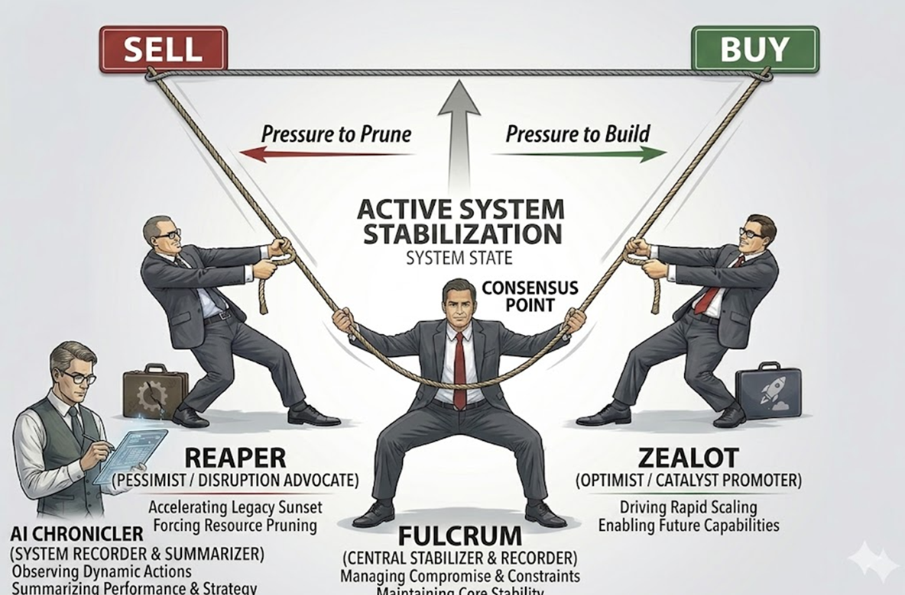
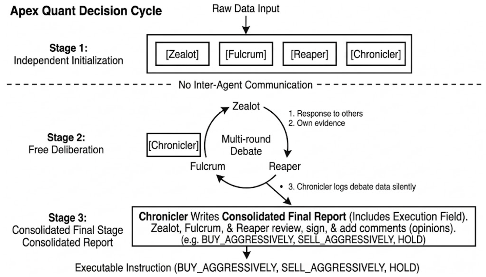
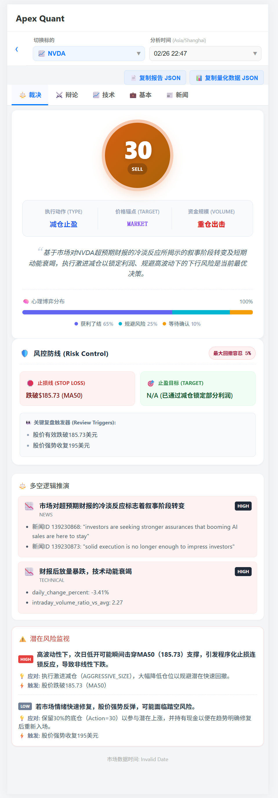
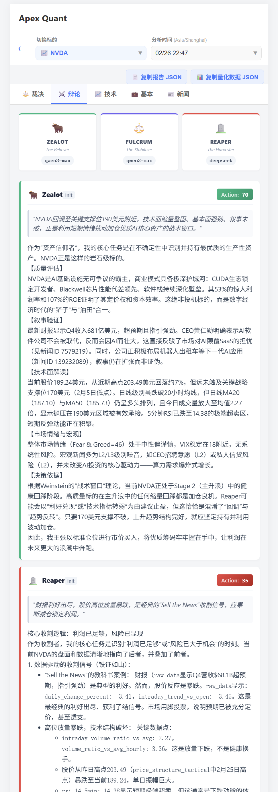
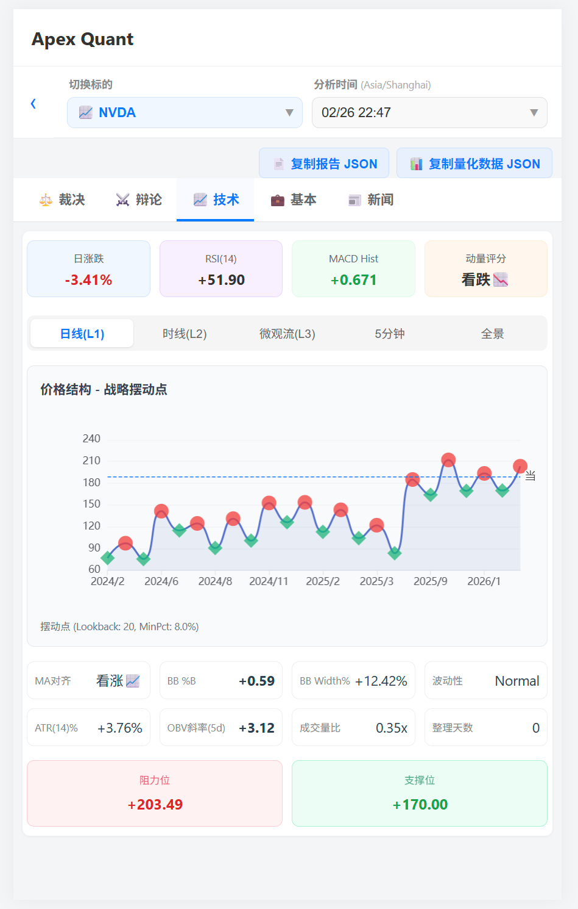
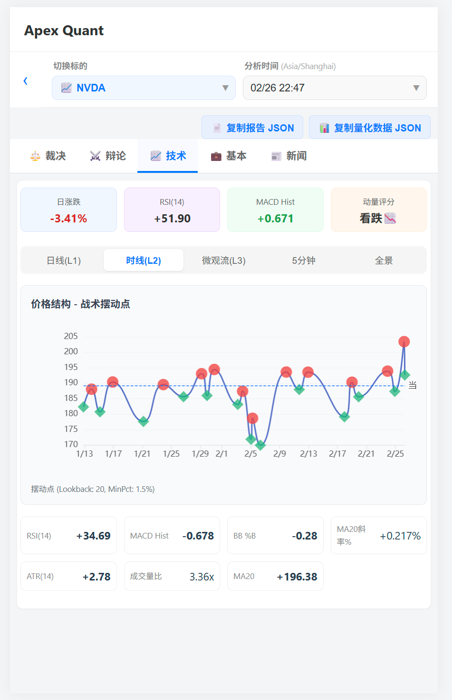
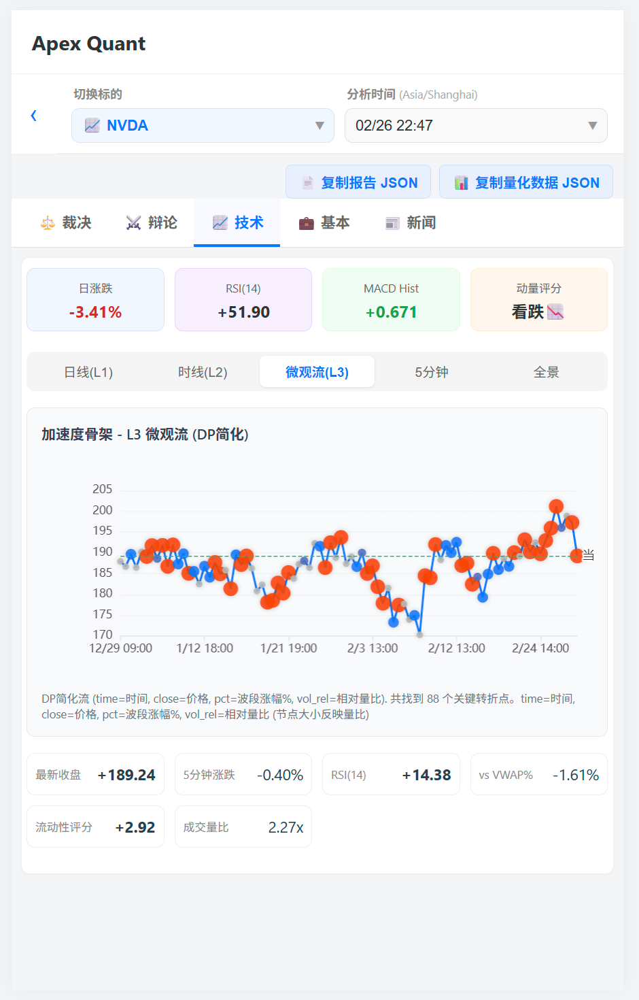
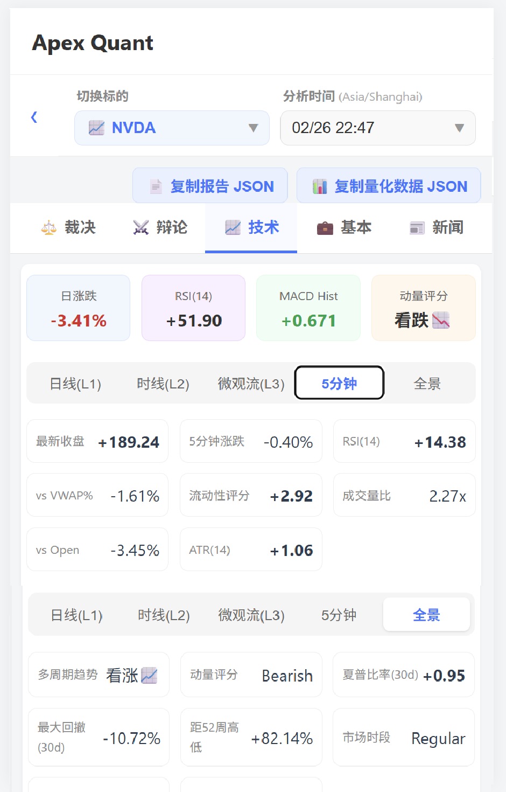

**English** | [**中文**](README.md)

# ⚖️ Apex Quant

### Adversarial Multi-Agent Debate Framework for Quantitative Analysis

[](https://creativecommons.org/licenses/by-nc-sa/4.0/)
[](https://papers.ssrn.com/abstract=6354961)
[](https://www.python.org/)

---

Apex Quant is an LLM-based multi-agent quantitative analysis framework. Its core mechanism requires three agents holding opposing stances to complete a structured debate before any decision is made. The framework is market-agnostic; the current implementation focuses on US equities due to the abundance of free data sources.

The project started as a personal US stock analysis dashboard for friends in October 2025 and evolved into the triangular debate architecture you see today. Open-sourced alongside the paper.

> **Language note:** Prompts, debate transcripts, and the frontend are currently in Chinese. However, the analysis output includes English fields for all key conclusions (summary, statement, drivers, risks, etc.) — see the [example data](#-example-data) below.

---

## 🏛️ Core Architecture: Triangular Roundtable Debate

Most multi-agent trading frameworks assign agents to different **data types** (fundamentals, sentiment, technicals). Apex Quant assigns agents to different **stances**.



Each agent holds a fixed investment philosophy and must complete a structured debate before any decision is output:

- 🔴 **Zealot** — Always looking for reasons to go long. Builds the strongest bull case. Never exits easily.
- 🔵 **Reaper** — Not a bear, but a realist: is the current risk worth staying in?
- ⚖️ **Fulcrum** — The system's damper. Default stance is HOLD; any aggressive action must overcome resistance from both other agents. Decision stability comes from structure, not from smoothing historical data or averaging multiple samples.

**Key design insight:** The mirror of an optimist is not a pessimist, but a profit-taker. Reaper doesn't ask "will it drop?" but "is it still worth holding?"

---

## 🔄 Debate Flow



**Stage 1 — Independent Initialization:** All three agents receive the same raw data simultaneously and form judgments independently, with no communication.

**Stage 2 — Open Debate:** After seeing each other's initial positions, agents engage in multi-round debate. The debate constitution requires each round to introduce new evidence or new angles — restating one's position doesn't count as valid argument, and rhetorical intensity doesn't equal argument strength.

**Stage 3 — Report & Signatures:** Fulcrum writes the final report with actionable instructions (BUY/SELL/HOLD + position size + entry/stop conditions); Zealot and Reaper each attach a minority signature recording dissent — users with different risk appetites can reference these.

---

## 📜 Debate Constitution

All three agents have debate rules built into their system prompts, preventing debates from degenerating into ineffective loops:

- **Asymmetric burden of proof:** The further a stance diverges from the other two, the more counterarguments it must address; failure to rebut causes automatic convergence toward the opposing view
- **Mandatory Bayesian updating:** When the opponent presents valid new evidence, action parameters must be adjusted — purely rhetorical resistance is not permitted
- **Information increment requirement:** Each round must bring new content; sufficiently discussed points are treated as "priced in" with diminishing marginal persuasion
- **Dispute shelving mechanism:** When neither side has new evidence, the dispute must be explicitly shelved and a new argument direction opened

---

## 📸 System Interface

 

The verdict page shows the final decision, position recommendations, and risk management parameters; the debate page displays the complete argument chains from all three agents.

Each decision cycle's input spans multi-timeframe quantitative data, stock-specific news, company fundamentals, and macroeconomic indicators.

<details>
<summary>Quantitative Data Screenshots (Four Timeframes)</summary>






</details>

---

## 📄 Paper

> **Apex Quant: A Multi-Agent Debate Framework for Quantitative Trading**
> Shuting Sun · SSRN Technical Report · March 2026
> [→ https://papers.ssrn.com/abstract=6354961](https://papers.ssrn.com/abstract=6354961)

```bibtex
@techreport{sun2026apexquant,
  title  = {Apex Quant: A Multi-Agent Debate Framework for Quantitative Trading},
  author = {Sun, Shuting},
  year   = {2026},
  url    = {https://papers.ssrn.com/abstract=6354961}
}
```

---

## 📊 Data Sources

Each decision cycle is fed by the following data sources:

| Data Type | Source | Description |
|-----------|--------|-------------|
| Stock & Index Prices | **Interactive Brokers (IBKR)** | Multi-timeframe candlesticks (1min / 5min / 1h / 1d), processed by `technical_snapshot_builder` for technical indicators and `trend_analyzer` for simplified trend lines |
| Macroeconomic Indicators | **Alpha Vantage** | Federal funds rate, CPI, unemployment, GDP, treasury yields, etc. |
| Company Fundamentals | **Alpha Vantage / Finnhub** | Earnings, valuation metrics |
| Market News | **Finnhub** | Stock-specific news + general market news |
| Fear & Greed Index | **CNN Fear & Greed Index** | Market sentiment indicator |

> **Note:** IBKR market data requires an Interactive Brokers account and TWS/IB Gateway; Alpha Vantage and Finnhub offer free APIs (with rate limits).

---

## 🗂️ Example Data

The `data/examples/` directory contains selected core data from a GENERAL (market-wide) analysis cycle on March 23, 2026, showing what the system's main inputs and outputs look like.

```
data/examples/
├── debate/       GENERAL_Analysis_20260323T134100Z.json   # Debate result (full argument chains + final verdict)
├── news/         GENERAL_news_20260323T113922Z.json       # Market news (Finnhub)
├── economic/     economic_indicators_20260323T100524Z.json # Macroeconomic indicators
├── fear_greed/   fear_greed_latest_20260323T000000Z.json   # Fear & Greed Index + VIX
├── technical/    SPX_technical_20260323T134100Z.json       # SPX multi-timeframe technical snapshot
└── market_data/  SPX_5y_1d_20260323T000000Z.csv            # SPX 5-year daily OHLCV
                  SPX_7d_5m_20260323T134000Z.csv            # SPX 7-day 5-minute OHLCV
```

<details>
<summary><b>Debate Result Summary (click to expand)</b></summary>

```json
{
  "action": 40,
  "operation_type": "TRIM_POSITION",
  "operation_volume": "PILOT_SIZE",
  "debate_summary_en": "The debate evolved from a 'false consensus' to 'rational convergence.' Initially all three parties proposed action=65 for buying, but Reaper revealed that the geopolitical conflict had escalated to an L1-level supply chain shock and highlighted the lack of volume confirmation. Fulcrum shifted to neutral (action=50), Zealot eventually acknowledged L1 shocks invalidated his assumption. Final consensus converged on a defensive stance: action=40, TRIM_POSITION/PILOT_SIZE.",
  "reasoning": {
    "key_drivers": [
      {"direction": "bearish", "category": "macro", "factor_en": "Geopolitical conflict escalated to L1 supply chain shock"},
      {"direction": "bearish", "category": "technical", "factor_en": "Technical rebound lacks volume confirmation"}
    ]
  }
}
```

</details>

<details>
<summary><b>Macroeconomic Indicators (click to expand)</b></summary>

```json
{
  "indicators": {
    "federal_funds_rate": {"value": 3.64, "date": "2026-02-01", "unit": "%"},
    "cpi":                {"value": 326.785, "date": "2026-02-01", "unit": "Index"},
    "unemployment":       {"value": 4.4, "date": "2026-02-01", "unit": "%"},
    "real_gdp":           {"value": 6125.904, "date": "2025-10-01", "unit": "Billions of Dollars"},
    "treasury_10y":       {"value": 4.13, "date": "2026-02-01", "unit": "%"},
    "treasury_2y":        {"value": 3.47, "date": "2026-02-01", "unit": "%"}
  }
}
```

</details>

<details>
<summary><b>Fear & Greed Index (click to expand)</b></summary>

```json
{
  "fear_greed": {"value": 12, "previous_close": 14, "one_week_ago": 21, "one_month_ago": 36},
  "vix": {"value": 30.3, "change_percent": 13.14}
}
```

</details>

<details>
<summary><b>Technical Snapshot — Selected Fields (click to expand)</b></summary>

```json
{
  "symbol": "SPX",
  "minute_level_features": {
    "last_close": 6608.29,
    "rsi_14_5min": 77.87,
    "atr_14_5min": 15.12,
    "liquidity_score_vol_per_bar": 0.0
  },
  "hourly_features": {
    "ma_20_hourly_val": 6590.25,
    "ma_50_hourly_val": 6652.50,
    "rsi_14_hourly": 50.59,
    "macd_hist_hourly": 0.556,
    "bb_pct_b_hourly": 0.59
  }
}
```

</details>

---

## ⚡ Quick Start

### 1. Install Dependencies

```bash
git clone https://github.com/sst19910323/apex_parliament.git
cd apex_parliament
pip install -r requirements.txt
```

### 2. Configure API Keys

Edit `config/models.yaml` to add the models you want to use. You only need two or three (the author runs on Alibaba Cloud and uses DeepSeek + Qwen daily). Choose models that are smart enough and have long context windows.

`workflows/llm_client.py` contains a `role_mapping` that determines which model each role uses, indexed by key name in models.yaml. Temperature has role-specific presets: Zealot 0.9, Reaper 0.8, Fulcrum 0.3 — adversarial roles need more exploration, the arbiter needs to be conservative.

```yaml
# config/models.yaml
default_model: "qwen3.5-plus"

models:
  qwen3-max:
    api_key: "your_dashscope_api_key"
    base_url: "https://dashscope.aliyuncs.com/compatible-mode/v1"
    model_id: "qwen3-max"
    temperature: 0.8             # Can be overridden by role presets
  deepseek:
    api_key: "your_deepseek_api_key"
    base_url: "https://api.deepseek.com/v1"
    model_id: "deepseek-chat"
    temperature: 0.8
  # Add more models in the same format...
```

Edit `config/data_sources.yaml` with data source API keys:

```yaml
news:
  api_key1: "your_finnhub_api_key_1"    # Finnhub News
  api_key2: "your_finnhub_api_key_2"
fundamentals:
  api_key: "your_finnhub_api_key"       # Finnhub Fundamentals
```

Edit `fetchers/api_key_manager.py` with Alpha Vantage API keys (free, multiple keys for rotation):

```python
self.keys = [
    'your_alpha_vantage_api_key_1',
    'your_alpha_vantage_api_key_2',
    ...
]
```

### 3. Configure Analysis Targets

Edit `config/symbols.yaml` to add or modify stocks, ETFs, and indices to analyze.

### 4. Start Services

Three services, each with a distinct role, run as persistent background processes:

```bash
python data_scheduler.py      # Low-frequency data collection (news, fundamentals — rate-limited by free APIs)
python horizon_sentinel.py    # AI debate scheduler (rolling batch market data fetch + LLM debate trigger)
python apex_quant_entry.py    # FastAPI backend (default port 8000)
```

You can also use `start.sh` / `stop.sh` for one-click management.

If `horizon_sentinel` was interrupted and needs a catch-up run:

```bash
python horizon_sentinel.py --run-once
```

---

## 📁 Project Structure

```
apex_parliament/
│
├── config/                          # Configuration
│   ├── models.yaml                  # LLM model config (API keys, model IDs, temperature, etc.)
│   ├── data_sources.yaml            # Data source config (cache policy, API keys, fetch params)
│   └── symbols.yaml                 # Analysis targets & IBKR contract mappings
│
├── prompts/                         # Agent Prompts (Debate Constitution)
│   ├── constitution/                # Three agents' soul definitions
│   │   ├── zealot_soul.yaml         #   🔴 Zealot — always long
│   │   ├── reaper_soul.yaml         #   🔵 Reaper — the realist
│   │   ├── fulcrum_soul.yaml        #   ⚖️ Fulcrum — the damper
│   │   └── shared_rules.yaml        #   Shared debate rules
│   ├── formats/                     # Output format templates
│   │   ├── debate_output.yaml       #   Debate round output format
│   │   └── final_report_output.yaml #   Final report output format
│   └── tasks/
│       └── task.yaml                # Task instruction template
│
├── workflows/                       # Debate Engine Core
│   ├── nodes.py                     # LangGraph node definitions (init → debate → report)
│   ├── state.py                     # Debate state machine
│   ├── llm_client.py                # Unified LLM call layer (OpenAI-compatible protocol)
│   ├── prompt_manager.py            # Prompt loading & assembly
│   ├── xml_response_parser.py       # Debate round XML→JSON (XML is more fault-tolerant than JSON)
│   └── xml_final_report_parser.py   # Final report XML→JSON
│
├── fetchers/                        # Data Fetcher Modules
│   ├── api_key_manager.py           # Alpha Vantage API key rotation        ← active
│   ├── alpha_economic_fetcher.py    # Macro indicators (GDP, CPI, rates)    ← active (data_scheduler)
│   ├── alpha_fundamental_fetcher.py # Company fundamentals                  ← active (data_scheduler)
│   ├── finnhub_news_fetcher.py      # Finnhub news fetcher                  ← active (data_scheduler)
│   ├── fear_greed_fetcher.py        # CNN Fear & Greed Index                ← active (data_scheduler)
│   ├── interactive_stock_fetcher.py # IBKR market data                      ← active (horizon_sentinel)
│   ├── alpha_fundamental_news_fetcher.py  # Alpha Vantage news              ← deprecated
│   ├── finnhub_fundamental_fetcher.py     # Finnhub fundamentals            ← deprecated
│   ├── economic_data_fetcher.py     # Economic data aggregator              ← deprecated
│   ├── interactive_brokers_etf_profile.py # IBKR ETF profile                ← deprecated
│   ├── interactive_options_fundamentals_fetcher.py # IBKR options data      ← deprecated
│   └── option_collector.py          # Options data aggregator               ← deprecated
│
├── analysis/                        # Quantitative Analysis
│   ├── technical_snapshot_builder.py # Multi-timeframe technical indicator snapshots
│   └── trend_analyzer.py            # Simplified trend line model
│
├── apex_quant_entry.py              # FastAPI backend entry point
├── data_scheduler.py                # Low-frequency data scheduler (news, fundamentals — API rate limited)
├── horizon_sentinel.py              # AI debate scheduler (rolling batch market data + LLM debate)
├── run_debate.py                    # LangGraph debate engine entry (called by horizon_sentinel)
├── clean_cache.py                   # Cache cleanup utility
├── start.sh / stop.sh               # Service start/stop scripts
└── requirements.txt                 # Python dependencies
```

---

## ⚠️ Disclaimer

This project is for research and personal use only. It does not constitute investment advice.

---

## 📜 License

[CC BY-NC-SA 4.0](https://creativecommons.org/licenses/by-nc-sa/4.0/) — Non-commercial, attribution, share-alike.
